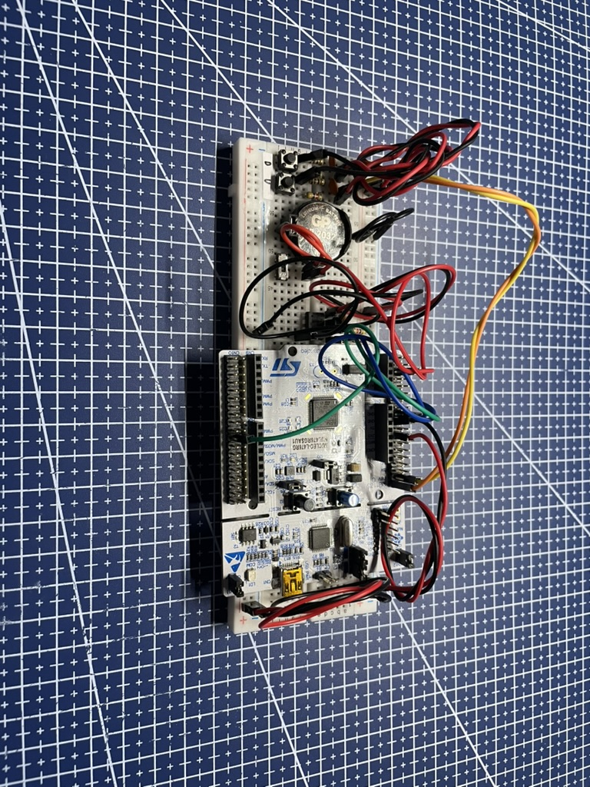

   

<h1 align="center">Two-factor Authentication Token Generator (TOTP)</h1>

  
  
  
  
  
  

---

## 📋 Description
> This project is a part of the engineering thesis authored by Jakub SQTX Sitarczyk.

This repository contains the implementation of a physical two-factor authentication (2FA) token generator based on the **Time-Based One-Time Password (TOTP)** algorithm, following the RFC 6238 specification. The project uses the **STM32L476RG microcontroller** on the NUCLEO development board and is entirely developed in **C** with the **HAL library**.

**Keywords:** *2FA, STM32, TOTP, authentication, token generator*.

   
    
   <b>Fig. 1</b> <i>Photo of the created prototype</i>

### Features
- **Platform Independence**: Generates authentication tokens every 30 seconds.
- **Secure Storage**: Private keys are stored in non-volatile EEPROM memory.
- **TOTP Implementation**: Conforms to the RFC 6238 standard, ensuring compatibility with major services supporting 2FA.
- **RTC Integration**: Uses the Real-Time Clock (RTC) module for precise time tracking.
- **Watchdog Security**: Prevents device freezing with IWDG functionality.

## 🛠️ Technicalities
- **Microcontroller**: STM32L476RG (NUCLEO-L476RG development board).
- **Programming Language**: C.
- **Libraries**:
  - **HAL**: High-Level Library for STM32 peripherals.
  - [**TOTP**](https://github.com/Netthaw/TOTP-MCU): Open-source implementation for token generation. (by @Netthaw)
  - **BASE32**: Key decoding library.
  - [**SHA-1**](https://github.com/Netthaw/TOTP-MCU): Cryptographic hashing. (by @Netthaw)

### How It Works
1. **Private Key Handling**:
   - The private key is encoded in BASE32 and stored securely in the EEPROM.

2. **Token Generation**:
   - Every 30 seconds, the device generates a new one-time password (OTP) based on the current UTC time and the private key.

3. **Autonomous Operation**:
   - No dependency on external systems—fully standalone device.

### Hardware Requirements
- **NUCLEO-L476RG Development Board**
- **24AA01 EEPROM Module**
- **CR2032 Battery and Holder**
- **Push Buttons and LEDs**
- Miscellaneous components (resistors, capacitors).

## Documentation
The complete technical documentation for this project is available in the following files:
- [English Version](https://github.com/SQTX/2FA_STM32_key_generator/blob/documentation/docs/ENG-tech_doc.md),
- [Polish Version](https://github.com/SQTX/2FA_STM32_key_generator/blob/documentation/docs/PL-tech_doc.md).

## ©️ MIT License
More information can be found here: [Link](https://github.com/SQTX/2FA_STM32_key_generator/blob/main/LICENSE)