# Two-factor Authentication Token Generator (TOTP) - Datasheet

## 1. Hardware Implementation

The first and crucial stage of the project was the development and proper preparation of the electronic system (*Figure 1.1*), ensuring the tool's efficient operation in subsequent phases. The designed system consists of four interconnected hardware modules responsible for the functions required for the proper operation of the system.

   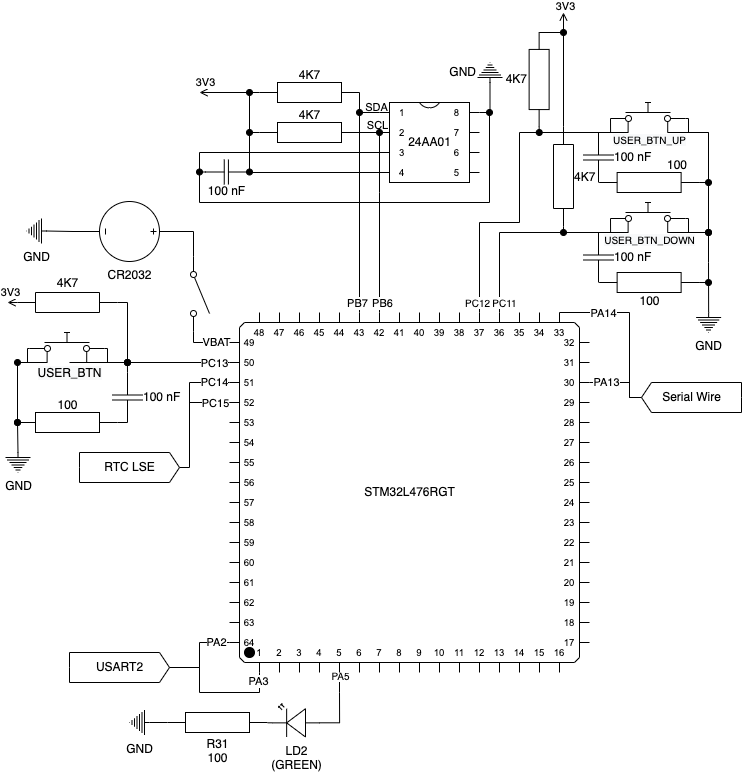
    
   <b>Fig. 1.1</b> <i>Electrical schematic of the developed system</i>

### 1.1. Microcontroller and NUCLEO Development Board

The main computational unit used in this project is the popular STM32L4 series microcontroller, characterized by a high clock frequency (up to 80 MHz) and energy efficiency, making it suitable for applications requiring both performance and minimal power consumption. This choice considered the potential for future project expansion, requiring device miniaturization while maintaining maximum energy efficiency (*Table 1.1*).
The microcontroller is mounted on a NUCLEO development board (*Figures 1.2, 1.3*), equipped with basic elements such as buttons, an LED control diode, and a built-in quartz resonator. The system features an integrated ST-Link V2-1 programmer, which plays a critical role in software development and debugging for this logic system.

#### 1.1.1. Microcontroller Specifications

**Tab. 1.1** *Specifications of the microcontroller used in the project [1]*
<table>
  <tr>
    <th>Parameter</th>
    <th>Value</th>
  </tr>
  <tr>
    <td>Microcontroller Model</td>
    <td>STM32L476RG</td>
  </tr>
  <tr>
    <td>Processor Architecture</td>
    <td>Arm® 32-bit Cortex®-M4</td>
  </tr>
  <tr>
    <td>Clock Frequency</td>
    <td>80 MHz</td>
  </tr>
  <tr>
    <td>Flash Memory</td>
    <td>1024 kB</td>
  </tr>
  <tr>
    <td>RAM</td>
    <td>128 kB</td>
  </tr>
  <tr>
    <td>Number of I/O Pins</td>
    <td>51</td>
  </tr>
  <tr>
    <td>Operating Voltage Range</td>
    <td>1.71–3.6 V</td>
  </tr>
  <tr>
    <td>Package</td>
    <td>LQFP 64 (10 × 10 × 1.4 mm)</td>
  </tr>
</table>

#### 1.1.2. Processor Modules Used in the Project

**Tab. 1.2** *List of processor modules used in the project [2]*
<table>
  <tr>
    <th>Module</th>
    <th>Description</th>
  </tr>
  <tr>
    <td>GPIO</td>
    <td>Digital input/output circuits enabling simple communication with external components such as LEDs or buttons.</td>
  </tr>
  <tr>
    <td>USART2</td>
    <td>Universal communication module allowing data exchange in synchronous or asynchronous mode. On the NUCLEO board, this module is connected by default to the integrated ST-Link V2-1 programmer, enabling communication between the microcontroller and a computer via a serial port.</td>
  </tr>
  <tr>
    <td>RTC</td>
    <td>Built-in real-time clock in the microcontroller.</td>
  </tr>
  <tr>
    <td>I2C1</td>
    <td>Synchronous communication interface allowing the microcontroller to exchange data with an external non-volatile EEPROM memory module.</td>
  </tr>
  <tr>
    <td>IWDG</td>
    <td>An independent (from the main system clock) watchdog timer preventing the microcontroller from locking up due to software errors.</td>
  </tr>
</table>

#### 1.1.3. NUCLEO Development Board Technical Schematic

   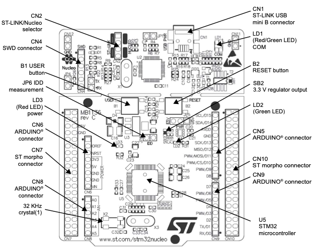
    
   <b>Fig. 1.2</b> <i>Technical schematic: top view of the NUCLEO board [2]</i>

   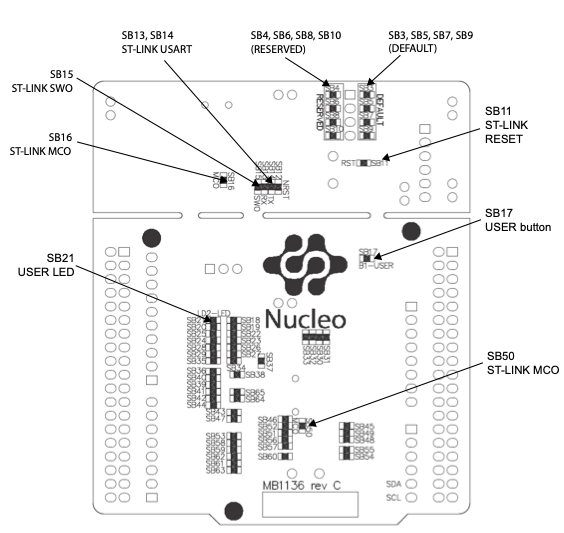
    
   <b>Fig. 1.3</b> <i>Technical schematic: bottom view of the NUCLEO board [2]</i>

<!-- TODO -->

#### 1.1.4. Pinout Table

The following table (*Table 1.3*) presents the usage of selected pins of the STM32L476RG microcontroller (*Figure 1.4*), along with their assigned interface or module (*Table 1.2*) and the description of each data line:

**Tab. 1.3** *Pin usage of the STM32L476RG microcontroller*
<table>
  <tr>
    <th>Pin Name</th>
    <th>Pin Function</th>
    <th>Interface/Module</th>
    <th>Description</th>
  </tr>
  <tr>
    <td>PA13</td>
    <td>SWDIO</td>
    <td rowspan="2">ST-Link</td>
    <td>Data line for the debugging interface</td>
  </tr>
  <tr>
    <td>PA14</td>
    <td>SWCLK</td>
    <td>Clock line for the debugging interface</td>
  </tr>
  <tr>
    <td>PA5</td>
    <td>LD2</td>
    <td rowspan="4">GPIO</td>
    <td>Digital output controlling an LED</td>
  </tr>
  <tr>
    <td>PC11</td>
    <td>USER_BTN</td>
    <td rowspan="3">Digital outputs controlling user buttons</td>
  </tr>
  <tr>
    <td>PC12</td>
    <td>USER_BTN_UP</td>
  </tr>
  <tr>
    <td>PC13</td>
    <td>USER_BTN_DOWN</td>
  </tr>
  <tr>
    <td>PA2</td>
    <td>USART2_TX</td>
    <td rowspan="2">USART2</td>
    <td>Data transmission line in serial communication</td>
  </tr>
  <tr>
    <td>PA3</td>
    <td>USART2_RX</td>
    <td>Data reception line in serial communication</td>
  </tr>
  <tr>
    <td>PC14</td>
    <td>OSC32_IN</td>
    <td rowspan="2">RTC LSE</td>
    <td rowspan="2">Microcontroller connection lines to the quartz oscillator</td>
  </tr>
  <tr>
    <td>PC15</td>
    <td>OSC32_OUT</td>
  </tr>
  <tr>
    <td>PB6</td>
    <td>I2C1_SCL</td>
    <td rowspan="2">I2C1</td>
    <td>Clock line of the I2C interface</td>
  </tr>
  <tr>
    <td>PB7</td>
    <td>I2C1_SDA</td>
    <td>Data line of the I2C interface</td>
  </tr>
</table>

   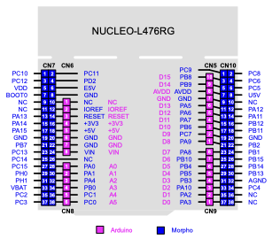
    
   <b>Fig. 1.4</b> <i>Pinout map on the NUCLEO board [2]</i>

#### 1.1.5. ST-Link V2-1 Programmer

The NUCLEO board's integrated ST-Link V2-1 programmer (*Figure 1.5*) was used in the project. It enabled both programming the microcontroller and debugging. Additionally, ST-Link V2-1 acted as a converter, translating USART communication to a USB serial interface, significantly simplifying data exchange and eliminating the need for additional external conversion tools.

   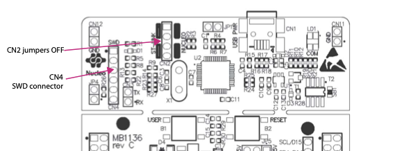
    
   <b>Fig. 1.5</b> <i>Technical schematic: top view of the NUCLEO board's integrated ST-Link V2-1 programmer [2]</i>

### 1.2. External Power Supply

In the default configuration of the NUCLEO development board, the STM32 microcontroller is powered directly from a computer via the ST-Link V2-1 programmer using the built-in USB port. This power source is essential for the operation of the entire system.
To increase the tool's independence from external devices (e.g., a computer), an alternative power source (*Figure 1.6*) was added to the project. This takes the form of a CR2032 lithium coin cell battery with a nominal voltage of approximately 3V. The battery is connected to the system through the VBAT pin, which is designed in the microcontroller to maintain power for critical embedded modules (RTC or IWDG).

   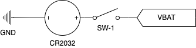
    
   <b>Fig. 1.6</b> <i>Electrical schematic for an alternative power supply based on a CR2032 battery</i>

In the default configuration of the NUCLEO board, the VBAT and VDD pins are connected via jumper SB45 (*Table 1.4*). In this configuration, the voltage supplied to the VBAT pin powers the entire system, not just selected microcontroller modules. This leads to excessive energy consumption, so a two-position switch was added to the circuit, allowing the alternative power source to be disconnected when not needed.

**Tab. 1.4** *Excerpt from the documentation describing the connection between VBAT and VDD pins [2]*

The introduction of an alternative power source ensures that data stored in the microcontroller's volatile RAM is preserved even if the system is disconnected from the main power supply (e.g., USB port). This makes the device more autonomous and resilient to temporary power interruptions.

### 1.3. Real-Time Clock and Watchdog

#### 1.3.1. Real-Time Clock

One of the primary design principles for the system was simplicity and cost minimization. As such, the RTC module embedded directly in the microcontroller was chosen as the clock system (*Figure 1.7*).

   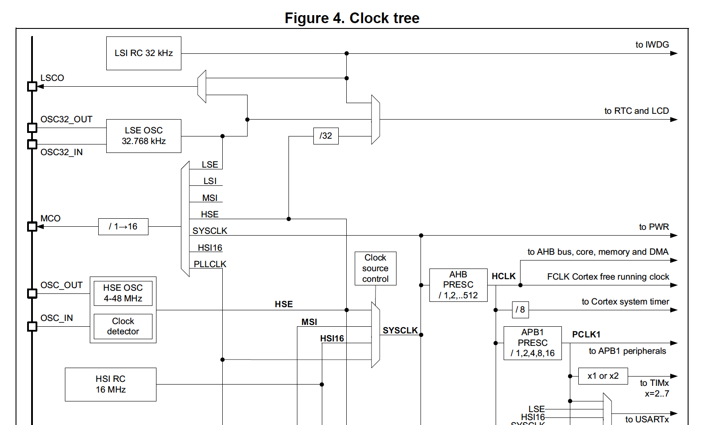
    
   <b>Fig. 1.7</b> <i>Excerpt from the microcontroller documentation showing connections between various RTC clock sources [1]</i>

By default, the embedded RTC clock in the STM32 operates in LSI mode, where the microcontroller itself generates internal clock pulses without the need for external sources. This solution is particularly useful for short-term timekeeping, as it is fast and does not consume additional pins. The main limitation of LSI mode is its very low accuracy of about 5% (*Figure 1.8*). This means that after 10 minutes, the clock can have a deviation of up to 30 seconds, which is unacceptable for the TOTP algorithm used.

   
    
   <b>Fig. 1.8</b> <i>Excerpt from the STM32 microcontroller documentation describing RTC accuracy in LSI mode [1]</i>

To address this issue, an additional external clock source in the form of the built-in NUCLEO LSE quartz resonator (frequency ~32 kHz) was used. Utilizing LSE mode in combination with the embedded clock mechanism enabled the MSI clock's autocalibration function, increasing accuracy and reducing the error to 0.25% (*Figure 1.9*). Ultimately, this means that the expected 30-second deviation will occur only after about 3.5 hours, which is fully satisfactory for the described prototype.

   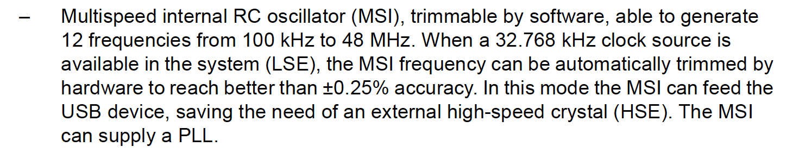
    
   <b>Fig. 1.9</b> <i>Excerpt from the STM32 microcontroller documentation describing RTC accuracy in MSI (LSE) mode [1]</i>

#### 1.3.2. Watchdog

To improve the reliability of the entire system, a Watchdog timer module was implemented. Its role is to monitor the continuous operation of the tool and protect against unforeseen software freezes.  
The IWDG module was used in the project, characterized by complete independence from the microcontroller's main clock. Unlike a similar WWDG module, stopping the RTC clock does not disable the Watchdog.  
The autonomy of the IWDG module is crucial for the energy efficiency of the project. The Watchdog operates independently of the main processor, allowing it to function even in energy-saving Standby mode (*Figure 1.10*). Moreover, the IWDG can generate wake-up signals for the microcontroller, enhancing versatility and supporting potential expansion.

   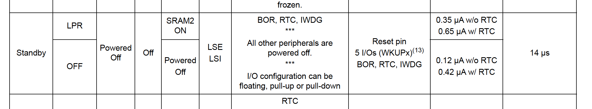
    
   <b>Fig. 1.10</b> <i>Excerpt from the documentation showing modules active during Standby mode and generating wake-up signals [1]</i>

### 1.4. Non-Volatile EEPROM Memory

Although the STM32L476RG features built-in 1 MB non-volatile FLASH memory, an independent EEPROM module was used in the project.
This decision was motivated by the following reasons:

1. **System Safety** — FLASH memory has a lower write cycle count compared to EEPROM. The microcontroller manufacturer declares approximately 10,000 cycles.
2. **Future Expansion** — The system was designed with future expansion in mind. Using an independent module allows for flexible and rapid system modifications.

#### 1.4.1. Technical Parameters of the Memory Module

**Tab. 1.5** *Technical parameters of the non-volatile EEPROM memory module [3]*
<table>
  <tr>
    <th>Parameter</th>
    <th>Value</th>
  </tr>
  <tr>
    <td>Memory type</td>
    <td>EEPROM</td>
  </tr>
  <tr>
    <td>Memory module</td>
    <td>24AA01-I/P</td>
  </tr>
  <tr>
    <td>Memory organization</td>
    <td>128 x 8 - bit</td>
  </tr>
  <tr>
    <td>Number of rewrite cycles</td>
    <td>>1,000,000</td>
  </tr>
  <tr>
    <td>Interface</td>
    <td>I2C (TWI)</td>
  </tr>
  <tr>
    <td>Clock frequency</td>
    <td>400 kHz</td>
  </tr>
  <tr>
    <td>Number of I/O pins</td>
    <td>8</td>
  </tr>
  <tr>
    <td>Operating voltage range</td>
    <td>1.71–5.5 V</td>
  </tr>
  <tr>
    <td>Package</td>
    <td>8-pin PDIP</td>
  </tr>
</table>

#### 1.4.2. Method of Connecting the Module to the Microcontroller

The memory module is connected according to the following diagram (*Figure 1.11*):

1. P1 and P2 are the communication lines of the I2C interface, namely SDA and SCL. They are connected to the microcontroller pins configured as I2C1 (PB6 and PB7). To avoid the risk of short-circuiting, the microcontroller inputs are set to open-drain mode. Therefore, two pull-up resistors (4.7 kΩ) connected to the power supply line (3.3 V) were added.
2. P4 is the power pin of the module (VCC), which is connected directly to the power supply line (3.3 V).
3. P8 is the ground pin of the module (VSS), which is connected directly to the ground line (GND).
4. P3 functions as the Write Protect (WP) input, which protects the module from unwanted data writing. To allow writing, the WP pin is connected to ground.
5. To reduce interference between the power line and the ground, a 100 nF capacitor is used (*Table 1.6*).

**Tab. 1.6** *Connection of the 24AA01 memory module to the STM32 microcontroller*
<table>
  <tr>
    <th>24AA01 Pins</th>
    <th>STM32 Pins</th>
    <th>Description</th>
  </tr>
  <tr>
    <td>P1 (SDA)</td>
    <td>PB7 (I2C1)</td>
    <td>+ Pull-up resistor 4.7 kΩ</td>
  </tr>
  <tr>
    <td>P2 (SCL)</td>
    <td>PB6 (I2C1)</td>
    <td>+ Pull-up resistor 4.7 kΩ</td>
  </tr>
  <tr>
    <td>P3 (WP)</td>
    <td>Ground (GND)</td>
    <td rowspan="2">100 nF capacitor between lines</td>
  </tr>
  <tr>
    <td>P4 (VCC)</td>
    <td>Power (3.3 V)</td>
  </tr>
  <tr>
    <td>P5 (A0)</td>
    <td>-</td>
    <td rowspan="3">STM32L476RG</td>
  </tr>
  <tr>
    <td>P6 (A1)</td>
    <td>-</td>
  </tr>
  <tr>
    <td>P7 (A2)</td>
    <td>-</td>
  </tr>
  <tr>
    <td>P8 (VSS)</td>
    <td>Ground (GND)</td>
    <td>-</td>
  </tr>
</table>

   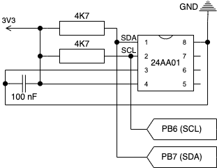
    
   <b>Fig.1.11</b> <i>Electronic schematic of the connection of the 24AA01 module in the developed system</i>

### 1.5. Communication with the System (GPIO)

Basic communication with the system was achieved using:

#### 1.5.1. Buttons

To allow the user to control the system and perform selected operations, buttons were required. By default, the NUCLEO board is equipped with one button (USER_BTN1), which is insufficient for this project. Therefore, two additional buttons (USER_BTN_UP and USER_BTN_DOWN) were added to the system (*Table 1.7*). 
To ensure uniform functionality, the new buttons were configured in the same way as the default built-in one. All buttons were connected in pull-up mode using a 4.7 kΩ resistor. To eliminate interference caused by the "contact bounce" effect, an RC filter consisting of a 100 Ω resistor and a 100 nF capacitor was applied to each button.

**Tab. 1.7** *GPIO pins used by specific buttons*
<table>
  <tr>
    <th>Button Name</th>
    <th>Pin Name</th>
    <th>Description</th>
  </tr>
  <tr>
    <td>USER_BTN1</td>
    <td>PC13</td>
    <td>Built-in on NUCLEO</td>
  </tr>
  <tr>
    <td>USER_BTN_UP</td>
    <td>PC12</td>
    <td rowspan="2">Added</td>
  </tr>
  <tr>
    <td>USER_BTN_DOWN</td>
    <td>PC11</td>
  </tr>
</table>

Schematic of GPIO pin connections (*Figure 1.12*):

   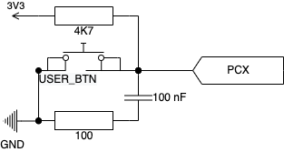
    
   <b>Fig.1.12</b> <i>Electronic schematic of a single button</i>

#### 1.5.2. LED Diode

A LED diode (LD2) built into the NUCLEO development board was used for visual evaluation of the Watchdog module's operation. By default, it is connected to the GPIO pin PA5, and a 100 Ω current-limiting resistor is used in its circuit (*Figure 1.13*).

   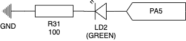
    
   <b>Fig.1.13</b> <i>Electronic schematic of the LD2 diode</i>

### 1.6. List of Components and Cost Estimate

The following table (*Table 1.8*) presents a list of all modules and components used in the design of the described electronic system. Furthermore, the table includes the current market prices of each component to estimate the total cost of the prototype.

**Tab. 1.8** *Technical parameters of the microcontroller used in the project [1]*
<table>
  <tr>
    <th>No.</th>
    <th>Component Name</th>
    <th>Quantity</th>
  </tr>
  <tr>
    <td>1</td>
    <td>STM32 NUCLEO-L476RG</td>
    <td>1</td>
  </tr>
  <tr>
    <td>2</td>
    <td>EEPROM 24AA01 -I/P</td>
    <td>1</td>
  </tr>
  <tr>
    <td>3</td>
    <td>Tact Switch 6x6mm</td>
    <td>2</td>
  </tr>
  <tr>
    <td>4</td>
    <td>2-position slide switch</td>
    <td>1</td>
  </tr>
  <tr>
    <td>5</td>
    <td>CR2032 battery holder</td>
    <td>1</td>
  </tr>
  <tr>
    <td>6</td>
    <td>CR2032 lithium battery</td>
    <td>1</td>
  </tr>
  <tr>
    <td>7</td>
    <td>4.7 kΩ resistor</td>
    <td>3</td>
  </tr>
  <tr>
    <td>8</td>
    <td>100 Ω resistor</td>
    <td>3</td>
  </tr>
  <tr>
    <td>9</td>
    <td>100 nF ceramic capacitor</td>
    <td>3</td>
  </tr>
</table>

The following items were not included in the list:

- USB cable (used for programming),
- Wiring (connecting the components),
- Prototype board (on which the prototype was developed).

## 2. Software Implementation

### 2.1. Introduction

This chapter discusses the details of the software implementation for controlling the designed electronic system. It presents and describes the tools, technologies, libraries, and methods used to configure the built-in modules of the STM32 microcontroller. The software was designed with a focus on reliability and simplicity of operation. The main functionality, which is the generation of authorization tokens (OTP), was complemented with additional operations to enhance the device's use. Basic configuration mechanisms were also implemented, significantly reducing the need for source code modification, making the system more user-friendly.

### 2.2. Programming Language and List of External Libraries Used

The software implemented in the prototype was entirely written in the C language, ensuring high code optimization and low-level control over the modules. The language itself was supplemented with standard libraries (std). During the development process, in addition to the built-in programming language libraries, external open-source libraries were used, whose licenses allow both commercial and non-commercial use (MIT license). These libraries enabled reliable implementation of cryptographic algorithms and significantly simplified the process of managing electronic peripherals, including the STM32 microcontroller and EEPROM memory.

**External Libraries Used in the Project:**

1. **HAL** — A library developed by STMicroelectronics to simplify control of STM32 microcontrollers by providing high-level access to the hardware and peripherals.
2. **TOTP** — A pre-developed algorithm implementation compliant with RFC 6238, enabling the generation of one-time authentication tokens.
3. **BASE32** — A library containing a script to decode BASE32 encoded text to its original form.
4. **SHA1** — Implements the SHA-1 hash function, used by the TOTP algorithm.
5. **EEPROM Driver** — A simple library containing two functions to read and write single bytes from the specified memory address in the 24AA01 EEPROM module.

### 2.3. STM32 Microcontroller Module Configuration

The main tool used during the software development was the STM32CubeIDE environment. Developed by STMicroelectronics, this IDE offers basic functions typical of modern code editors; auto-completion, syntax hints, and debugging. The major advantage over competitors is the fact that the software features an advanced microcontroller configuration system, presented as a graphical user interface (GUI).
Module configurations used in the prototype:

#### 2.3.1. Debugger (Serial Wire)

Activation of the Serial Wire Debug (SWD) interface as the primary debugging mode used in the STM32 microcontroller system.

**Assigned pins:** PA13, PA14.  
**Configuration in STM32CubeIDE:**

- Category: **_System Core_**,
  - Section: **_SYS_**,
    - Debug: **_Serial Wire_**.

#### 2.3.2. USART

Setting the USART2 serial interface to asynchronous communication mode, meaning no clock synchronization between devices exchanging data.  
**Assigned pins:** PA2, PA3.  
**Configuration in STM32CubeIDE:**

- Category: **_Connectivity_**,
  - Section: **_USART2_**,
    - Mode: **_Asynchronous_**.

#### 2.3.3. GPIO

Definitions of digital inputs and outputs allowed for the configuration of elements enabling direct communication between the tool and the user (LEDs and buttons) (*Table 2.1*).

**Assigned pins:** PA2, PA3.  
**Configuration in STM32CubeIDE:**  
Category: **_System Core_**,  
Section: **_GPIO_**.

**Tab. 2.1** *Basic parameters of digital GPIO input and output pins*
<table>
  <tr>
    <th>Element</th>
    <th>Assigned Name</th>
    <th>Mode</th>
    <th>Output State</th>
  </tr>
  <tr>
    <td>LED</td>
    <td>LD2</td>
    <td>GPIO_OUTPUT</td>
    <td>Low</td>
  </tr>
  <tr>
    <td rowspan="3">Buttons</td>
    <td>USER_BTN_1</td>
    <td>GPIO_EXTI13</td>
    <td rowspan="3">Interrupt generated every 1 ms</td>
  </tr>
  <tr>
    <td>USER_BTN_UP</td>
    <td>GPIO_EXTI12</td>
  </tr>
  <tr>
    <td>USER_BTN_DOWN</td>
    <td>GPIO_EXTI11</td>
  </tr>
</table>

#### 2.3.4. RTC

Configuration of the built-in RTC clock module (LSI) along with an external clock pulse generator (LSE) in the form of a quartz resonator, as well as its connection to the MSI auto-configuration module.

**Assigned pins:** PC14, PC15.  
**Configuration in STM32CubeIDE:**  
_The clock module should be activated first:_

- Category: **_System Core_**,
  - Section: **_RCC_**,
    - Low Speed Clock (LSE): **_Crystal/Ceramic Resonator_**.
    - Configuration: **_RCC Parameters_**,
      - MSI Auto Calibration: **_Enable_** (this activation should occur automatically).

_Next, activate the external pulse source (LSE):_

- Category: **_Timers_**,
  - Section: **_RTC_**,
    - Enable option: **_Activate Clock Source_**.

#### 2.3.5. I2C

To enable communication with the external EEPROM memory module, the built-in I2C1 interface of the microcontroller was activated, allowing data exchange between devices.

**Assigned pins:** PB6, PB7.  
**Configuration in STM32CubeIDE:**

- Category: **_Connectivity_**,
  - Section: **_I2C1_**,
    - I2C: **_I2C_**,
    - (Other parameters remain in the default settings).

#### 2.3.6. IWDG

To protect the system from unexpected software freezes, the Watchdog module was activated in IWDG mode.

**Configuration in STM32CubeIDE:**

- Category: **_System Core_**,
  - Section: **_IWDG_**,
    - Enable option: **_Activated_**.

#### 2.3.7. NVIC

To optimize the device’s working time, the buttons connected to the digital GPIO inputs were configured in the GPIO_EXTI mode, which allows generating system interrupts when pressed. To fully leverage the interrupt mechanism without the risk of freezing the system, modifications to the default priority values in the interrupt controller (NVIC) table were necessary.

**Configuration in STM32CubeIDE:**  
_Interrupt system configuration for GPIO inputs_,

- Category: **_System Core_**,
  - Section: **_GPIO_**, * Tab: **_NVIC_**, * Enable option: **_EXTI line [15:10] interrupts_**.  
    _Interrupt priority changes:_
- Category: **_System Core_**,
  - Section: **_IWDG_**,
    - Changes in priority values are presented in the table below (*Table 2.2*).

**Tab. 2.2** *Change of priority values for individual interrupts*
<table>
  <tr>
    <th>Interrupt Name</th>
    <th>Default Priority</th>
    <th>New Priority</th>
    <th>Description</th>
  </tr>
  <tr>
    <td>Time base: System tick timer</td>
    <td>9</td>
    <td>0</td>
    <td>Interrupt generated every 1 ms</td>
  </tr>
  <tr>
    <td>EXTI line [15:10] interrupts</td>
    <td>0</td>
    <td>10</td>
    <td>Interrupt generated by a pulse received on GPIO input pins 10 to 15</td>
  </tr>
</table>

### 2.4. Memory Module Implementation

For the purposes of this project, an independent system for storing and managing data in memory was developed. In the prototype, information is stored as general data (related to the entire device) and individual keys with their associated information. The system was designed with optimization in mind due to limited storage space. The system does not have protections to prevent accidental (or intentional) memory overflow or data leakage. This option could represent a potential path for future software development.

#### 2.4.1. Data Storage Method

Data stored in memory is divided into two independent groups:

1. **General Data** — includes essential information required for every initialization attempt of the system (*Figure 2.1*).  
   General data includes:
   1. **Initialization byte** — a statically stored value in the code, indicating that the memory has likely already been used.
   2. **Last memory address** — the address of the last available memory cell.
   3. **Maximum number of keys** — the number of keys that can fit in the memory.
   4. **Current number of keys** — the number of keys currently stored in the memory.
   5. **Last used key** — indicates the address of the last active key.
   6. **System flags** — bits describing the system configuration and status.

   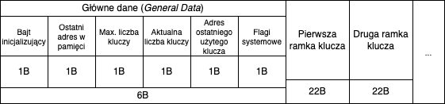
    
   <b>Fig. 2.1</b> <i>Illustrative diagram showing the format of data storage in memory</i>

1. **Keys with Information** — each key, along with its associated data, is stored in the form of an individual 22-byte frame (*Figure 2.2*). The structure of this frame contains the following information:
   1. **Key Index** — the unique number of the key in memory.
   2. **Key and Name Size** — information about the number of characters of the stored key and its name. The 4 most significant bits relate to the key, while the 4 least significant bits refer to the name.
   3. **Key** — the decoded private key, stored in plain text.
   4. **Name** — the name assigned to the key by the user (max. 5 characters).
   5. **Key Flags** — individual bits describing the key's characteristics. (Only the most significant bits of the available byte are used).
   6. **Overwrite Flag** (OW) — indicates that the frame is inactive and can be overwritten with a new key.
   7. **CRC** — a byte intended for the checksum of the entire frame. This mechanism ultimately was not included in the described system implementation.

   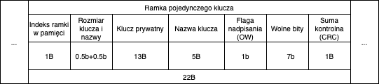
    
   <b>Fig. 2.2</b> <i>Illustrative diagram of a single frame (key) stored in memory</i>

#### 2.4.2. Memory Operations

Most of the implemented memory operations in the code were realized through specific "jumps" between individual bytes, which are placed at specific positions inside the frames. The frames themselves are stored in memory one after the other, which also allows precise transitions between successive keys.

**Example functions controlling the memory module:**

- Checking and initializing memory (*Figure 2.4*),
- Writing or reading general data,
- Writing or reading data from the key frame,
- Generating a new frame based on the provided information,
- Function to check the status of the overwrite flag (OW),
- Function to reset the frame and activate the overwrite flag (OW).

### 2.5. RTC Module Implementation and Synchronization

The RTC clock module is a crucial component for generating OTP tokens. The TOTP algorithm requires access to the current Universal Time Coordinated (UTC). To enhance user comfort during the synchronization process, the system is equipped with a simple mechanism for configuring UTC based on the entered local data.

**RTC Clock Operations:**

1. **Clock Synchronization** — the user is prompted to enter the current date and time in their local time zone via the keyboard. The data should be provided in the following format: `[dd-mm-yyyy,hh:mm:ss]`.  
   The acquired string is divided into segments corresponding to the current date and time. The time is further adjusted based on the user's time zone information, enabling correct conversion from local time to UTC. The processed data is then sent to the built-in RTC module, which updates it over time.
2. **Retrieving the Current Time and Date** — this operation only requires calling the appropriate functions from the HAL library, which read the data stored in the RTC module and assign it to designated variables.
3. **RTC Module Initialization** — the primary task of the function is to verify whether the data stored in the RTC module matches the time configured by the user. If the retrieved values indicate a reset of the module, the synchronization function is automatically triggered (*Figure 2.3*).

   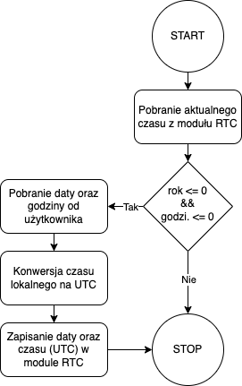
    
   <b>Fig. 2.3</b> <i>Flowchart of RTC Clock Initialization</i>

4. **Calculating the Timestamp** — based on the provided current date and time, the function calculates and returns the time in the UNIX Epoch Timestamp format.

### 2.6. Device Initialization Process

Before the system can start functioning properly, an initialization process must be performed. During this process, the device verifies the correct operation of key modules, checks the availability of required data, and loads the general information into the system's operational memory.  
The initialization process consists of seven steps, which must be successfully completed for the system to begin generating tokens (*Figure 2.5*).

**The individual stages include:**

1. **EEPROM Memory Initialization** — verifying memory compatibility with the system. In the case of the first device startup, the memory is cleared and undergoes the initialization process (*Figure 2.4*).
2. **RTC Clock Initialization** — checking the current time stored in the RTC module. If the clock has not been previously configured, the synchronization process is automatically initiated (*Figure 2.3*).

   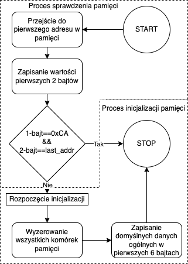
    
   <b>Fig. 2.4</b> <i>Flowchart of EEPROM Memory Initialization</i>

1. **Retrieve General Data from Memory** — reading basic information (general data) from the non-volatile memory module. This data is loaded into operational memory and displayed to the user.
2. **Set the Last Used Key as Active** — the address of the last used key frame is set as active.
3. **Load the Key from Memory** — loading the private key based on the address of the active key frame.
4. **Switch to the Appropriate Mode** — according to the user configuration, the device switches to one of two modes: passive or active.
5. **Start Operation** — the system is fully initialized and ready for operation. The process of generating OTP tokens begins.

   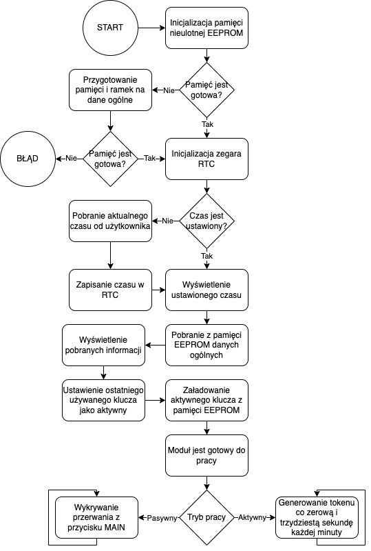
    
   <b>Fig. 2.5</b> <i>Flowchart depicting the stages of the system initialization process</i>

### 2.7. OTP Token Generation

Regardless of the mode in which the device operates, the process of generating OTP tokens proceeds in the same manner. The key element is preparing the appropriate input data, which is then processed by the cryptographic TOTP algorithm implemented in the system (*Figure 2.6*).

**Token Generation Process:**

1. **Load the Private Key** — the active private key is read from the device memory and then passed to the function as plain text. According to the algorithm’s requirements, it does not accept data encoded in BASE32 format.
2. **Retrieve and Convert Time** — the current time is read from the RTC module and converted into the UNIX Epoch Timestamp format.
3. **Provide Additional Parameters** — two other values, which are permanently encoded in the code, are passed to the algorithm:
   1. time interval (`= 30s`),
   2. number of characters in the token (`= 6`).
4. **Generate the Token** — all input data, i.e., the private key, time in UNIX Epoch Timestamp format, and additional parameters, are passed to the main TOTP algorithm function.

As a result, the current OTP token is generated and transmitted to the user via the serial port.

   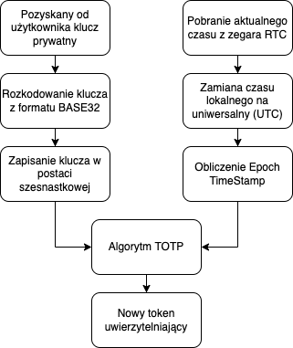
    
   <b>Fig. 2.6</b> <i>Flowchart depicting the OTP token generation process</i>

### 2.8. Additional Options and Settings

The device provides the user with the option to perform additional operations (*Figure 2.7*) related to key database management, changing the operation mode, and configuring the system itself.

   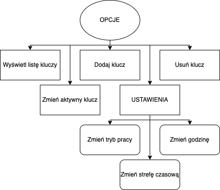
    
   <b>Fig. 2.7</b> <i>Flowchart of available system options and settings</i>

#### 2.8.1. Displaying the Key List

**Purpose:**  
The function displays the user the current list of names of all keys stored in the device memory.

**Operation:**  
The algorithm searches through the saved memory frames and reads the names stored in them. The number of keys read should match the current number of keys defined in the device's general data. The obtained names are saved in the operational memory and then presented to the user through the interface as a list (*figure 2.8*).

**Algorithm Flowchart:**

   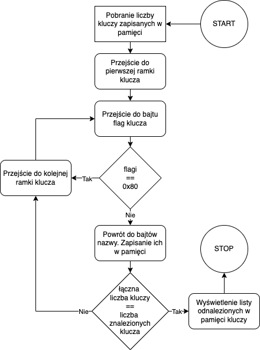
    
   <b>Fig. 2.8</b> <i>Flowchart of the algorithm:   Displaying keys</i>

#### 2.8.2. Changing the Active Key

**Purpose:**  
This function allows changing the active key, based on which new authentication tokens are generated.

**Operation:**  
The algorithm searches through the key frames to find a name that matches the one provided by the user. If a match is found and the overwrite flag (OW) is inactive, the address of the frame for the given key is stored in the system's operational memory as the active key. From that point on, the algorithm uses this key during the OTP token generation process (*figure 2.9*).

**Algorithm Flowchart:**

   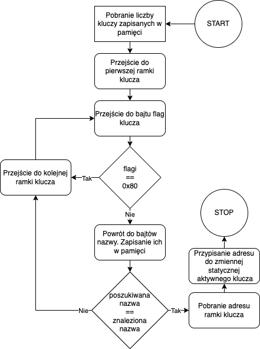
    
   <b>Fig. 2.9</b> <i>Flowchart of the algorithm:   Changing the key</i>

#### 2.8.3. Adding a Key

**Purpose:**  
This function allows adding a new authentication key to the system. The keys stored in memory can be alternately used to generate OTP tokens.

**Operation:**  
The system verifies the possibility of adding a new key by checking whether the set limit has been reached. If adding is possible, the user is asked to provide two pieces of information: the private key and its name (up to 5 characters). The private key is decoded from BASE32 format to plain text, which optimizes memory usage because the TOTP algorithm itself does not operate on encoded values. Then, based on the received data, a new frame is created. The system locates the first available memory space or overwrites an existing frame in which the overwrite flag (OW) is active. Finally, the total number of keys in the system is updated (*figure 2.10*).

**Algorithm Flowchart:**

   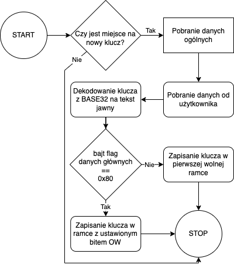
    
   <b>Fig. 2.10</b> <i>Flowchart of the algorithm:   Adding a key</i>

#### 2.8.4. Deleting a Key

**Purpose:**  
This function allows deleting any saved private key along with its associated data from the memory.

**Operation:**  
The algorithm searches for the key based on the name provided by the user. After locating it, the key's frame is cleared, and the overwrite flag (OW) is set to 1, preparing it for future writing. Finally, the total number of keys in the system is updated (*figure 2.11*).

**Algorithm Flowchart:**

   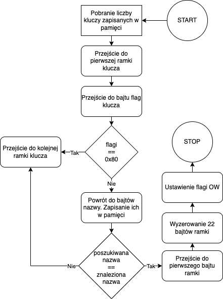
    
   <b>Fig. 2.11</b> <i>Flowchart of the algorithm:   Deleting a key</i>

#### 2.8.5. Changing the Operating Mode

The created device offers two operating modes, differing in the way authentication tokens are generated. The user can switch between them at any time, adapting the system to their needs.

**Available Operating Modes:**
1. **Passive** — The authentication token is generated automatically, regardless of the user's actions. The generation process occurs continuously at specified time intervals.
2. **Active** — The authentication token is generated only on user demand by pressing the USER_BTN1 button. The press triggers a system interrupt, during which the token generation process is carried out. After the token is created, the interrupt ends, and the generated token is sent to the user through the communication interface. The device then enters the waiting state.

#### 2.8.6. Changing the Time

The process of changing the time is analogous to the initialization of the unsynchronized RTC clock. The user is asked for the current date and local time. This data is then split, converted to UTC time, and finally passed to the built-in RTC clock module.

#### 2.8.7. Changing the Time Zone

**NOTE:** The described configuration has not been implemented in the final version of the prototype. All data concerning the conversion of local time to UTC are statically saved in the code. Introducing changes requires direct intervention in the system's code.

## 3. References

- [1] (2015) ‘Datasheet - STM32L476xx - Ultra-low-power Arm® Cortex®-M4 32-bit MCU+FPU’, STMicroelectronics. Available at: https://www.st.com/en/microcontrollers-microprocessors/stm32l476rg.html#documentation (Accessed: 2024).
- [2] (2014) ‘STM32 Nucleo-64 boards’, STMicroelectronics. Available at: https://www.st.com/resource/en/user_manual/um1724-stm32-nucleo64-boards-mb1136-stmicroelectronics.pdf (Accessed: 2020).
- [3] (2014) ‘STM32 Nucleo-64 boards’, STMicroelectronics. Available at: https://www.st.com/resource/en/user_manual/um1724-stm32-nucleo64-boards-mb1136-stmicroelectronics.pdf (Accessed: 2020).

## 4. Author's Comment

* The presented documentation is only a fragment of the engineering thesis by Jakub Sitarczyk submitted for evaluation on 11.12.2024.
* The original work was created in Polish. The content has been directly translated into English, excluding the figures and diagrams.
* The entire thesis is licensed under the MIT license.