# Two-factor Authentication Token Generator (TOTP) - Datasheet

## 1. Realizacja części sprzętowej

Pierwszym, a zarazem kluczowym etapem realizacji projektu było opracowanie oraz właściwe przygotowanie układu elektronicznego (*rysunek 1.1*), który zapewni sprawne działanie narzędzia w przyszłych etapach. Opracowany układ składa się z 4 wzajemnie połączonych modułów sprzętowych, których zadaniem jest realizacja funkcji niezbędnych do prawidłowego działania systemu.

   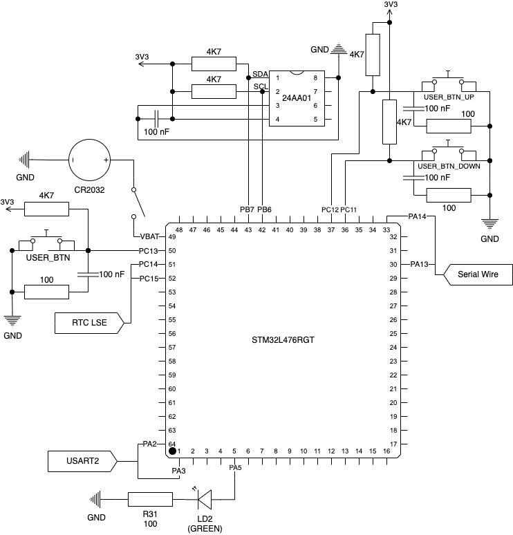
    
   <b>Rys.1.1</b> <i>Schemat elektryczny opracowanego układu</i>

Istotnym elementem przy projektowaniu układu było optymalne wykorzystanie zasobów dostępnych w samym mikrokontrolerze. Zamiast wprowadzania zbędnych komponentów zewnętrznych, w prototypie wykorzystano funkcje i moduły wbudowane w strukturę procesora, co pozwoliło na zmniejszenie złożoności układu oraz ograniczenie kosztów.
Poniższy fragment dokumentacji szczegółowo omawia zarówno aspekty sprzętowe układu, jak i funkcjonalność poszczególnych modułów procesora.

### 1.1. Mikrokontroler oraz układ rozwojowy NUCLEO

Główną jednostką obliczeniową zastosowaną w opisywanym projekcie jest popularny mikrokontroler z serii STM32L4. Charakteryzujący się wysoką częstotliwością taktowania (wynoszącą do 80 MHz) oraz dużą energooszczędnością, co czyni go odpowiednim wyborem do zastosowań wymagających zarówno wydajności, jak i minimalizacji zużycia energii. Decyzja o wyborze tego mikrokontrolera została podjęta z uwzględnieniem możliwości przyszłej rozbudowy projektu, co wiąże się z koniecznością miniaturyzacji urządzenia przy jednoczesnym zachowaniu maksymalnej efektywności energetycznej (*tabela 1.1*).
Mikrokontroler jest osadzony na płytce rozwojowej NUCLEO (*rysunek 1.2, 1.3*), która została domyślnie wyposażona jest w podstawowe elementy, takie jak przyciski, diodę kontrolną LED, wbudowany rezonator kwarcowy. Układ posiada zintegrowany programator ST-Link V2-1, który to odgrywa kluczową rolę w procesie tworzenia i debugowania oprogramowania dla tego układu logicznego.

#### 1.1.1. Parametry techniczne mikrokontrolera

**Tab. 1.1** *Parametry techniczne zastosowanego w projekcie mikrokontrolera [1]*
<table>
  <tr>
    <th>Parametr</th>
    <th>Wartość</th>
  </tr>
  <tr>
    <td>Model mikrokontrolera</td>
    <td>STM32L476RG</td>
  </tr>
  <tr>
    <td>Architektura procesora</td>
    <td>Arm® 32-bit Cortex®-M4</td>
  </tr>
  <tr>
    <td>Częstotliwość taktowania</td>
    <td>80 MHz</td>
  </tr>
  <tr>
    <td>Pamięć Flash</td>
    <td>1024 kB</td>
  </tr>
  <tr>
    <td>Pamięć RAM</td>
    <td>128 kB</td>
  </tr>
  <tr>
    <td>Liczba pinów I/O</td>
    <td>51</td>
  </tr>
  <tr>
    <td>Zakres napięcia pracy</td>
    <td>1,71–3,6 V</td>
  </tr>
  <tr>
    <td>Obudowa</td>
    <td>LQFP 64 (10 × 10 × 1,4 mm)</td>
  </tr>
</table>

#### 1.1.2. Moduły procesora wykorzystane w projekcie

**Tab. 1.2** *Lista wykorzystanych w projekcie modułów mikrokontrolera [2]*
<table>
  <tr>
    <th>Moduł</th>
    <th>Opis</th>
  </tr>
  <tr>
    <td>GPIO</td>
    <td>Cyfrowe układy wyjścia/wejścia umożliwiające nawiązanie prostej
komunikacji z zewnętrznymi elementami, takimi jak diody LED lub
przyciski.</td>
  </tr>
  <tr>
    <td>USART2</td>
    <td>Uniwersalny moduł komunikacyjny, umożliwiający wymianę danych
w trybie synchronicznym lub asynchronicznym. W projekcie płytce
NUCELO moduł domyślnie połączony jest z wbudowanym
programator ST-Link V2-1, który pozwala na komunikację
mikrokontrolera z komputerem po porcie szeregowym.</td>
  </tr>
  <tr>
    <td>RTC</td>
    <td>Wbudowany w mikrokontroler zegar czasu rzeczywistego.</td>
  </tr>
  <tr>
    <td>I2C1</td>
    <td>Synchroniczny interfejs komunikacyjny umożliwiający
mikrokokontrolerowi wymianę danych z zewnętrznym modułem
pamięci nieulotnej EEPROM.</td>
  </tr>
  <tr>
    <td>IWDG</td>
    <td>Niezależny (od głównego zegara systemowego) licznik
zabezpieczający, zapobiegający zablokowaniu mikrokontrolera w
przypadku błędów oprogramowania.</td>
  </tr>
</table>

#### 1.1.3. Schemat techniczny płytki rozwojowej NUCLEO

   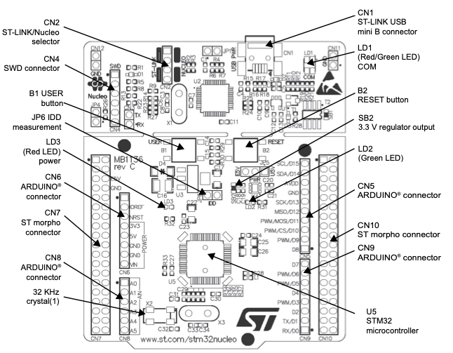
    
   <b>Rys.1.2</b> <i>Schemat techniczny: widok płytki NUCLEO z góry [2]</i>

   
    
   <b>Rys.1.3</b> <i>Schemat techniczny: widok płytki NUCLEO z dołu [2]</i>

#### 1.1.4. Lista wyprowadzeń (pinów)

Poniższa tabela (*tabela 1.3*) przedstawiająca sposób wykorzystania wybranych pinów mikrokontrolera STM32L476RG (*rysunek 1.4*), wraz z przypisanym do nich interfejsem lub modułem (*tabela 1.2*) oraz znaczeniem poszczególnych linii danych:

**Tab. 1.3** *Sposób wykorzystania pinów mikrokontrolera STM32L476RG*
<table>
  <tr>
    <th>Nazwa pinu</th>
    <th>Funkcja pinu</th>
    <th>Interface/Moduł</th>
    <th>Opis</th>
  </tr>
  <tr>
    <td>PA13</td>
    <td>SWDIO</td>
    <td rowspan="2">ST-Link</td>
    <td>Linia danych interfejsu debugowania</td>
  </tr>
  <tr>
    <td>PA14</td>
    <td>SWCLK</td>
    <td>Linia zegarowa interfejsu debugowania</td>
  </tr>
  <tr>
    <td>PA5</td>
    <td>LD2</td>
    <td rowspan="4">GPIO</td>
    <td>Wyjście cyfrowe sterujące diodą LED</td>
  </tr>
  <tr>
    <td>PC11</td>
    <td>USER_BTN</td>
    <td rowspan="3">Wyjścia cyfrowe sterujące przyciskami użytkownika</td>
  </tr>
  <tr>
    <td>PC12</td>
    <td>USER_BTN_UP</td>
  </tr>
  <tr>
    <td>PC13</td>
    <td>USER_BTN_DOWN</td>
  </tr>
  <tr>
    <td>PA2</td>
    <td>USART2_TX</td>
    <td rowspan="2">USART2</td>
    <td>Linia transmisji danych w komunikacji szeregowej</td>
  </tr>
  <tr>
    <td>PA3</td>
    <td>USART2_RX</td>
    <td>Linia odbioru danych w komunikacji szeregowej</td>
  </tr>
  <tr>
    <td>PC14</td>
    <td>OSC32_IN</td>
    <td rowspan="2">RTC LSE</td>
    <td rowspan="2">Linie połaczenia mikrokontrolera z oscylatorem kwarcowym</td>
  </tr>
  <tr>
    <td>PC15</td>
    <td>OSC32_OUT</td>
  </tr>
  <tr>
    <td>PB6</td>
    <td>I2C1_SCL</td>
    <td rowspan="2">I2C1</td>
    <td>Linia zegarowa interface I2C</td>
  </tr>
  <tr>
    <td>PB7</td>
    <td>I2C1_SDA</td>
    <td>Linia danych interface I2C</td>
  </tr>
</table>

   
    
   <b>Rys.1.4</b> <i>Mapa rozmieszczenia pinów na płytce NUCLEO [2]</i>

#### 1.1.5. Programatora ST-Link V2-1

W procesie realizacji projektu wykorzystano wbudowany w płytkę NUCLEO programator ST-Link V2-1 (*rysunek 1.5*). Umożliwił on zarówno programowanie mikrokontrolera, jak i przeprowadzanie procesu debugowania. Dodatkowo ST-Link V2-1 pełnił funkcję konwertera, przeprowadzając translację komunikacji USART na interfejs szeregowy USB, co znacząco ułatwiło wymianę danych i wyeliminowało potrzebę stosowania dodatkowych zewnętrznych narzędzi konwertujących.

   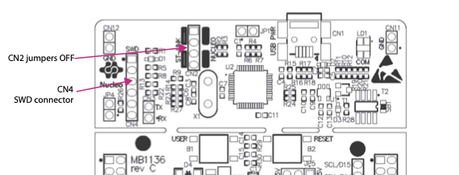
    
   <b>Rys.1.5</b> <i>Schemat techniczny: widok wbudowanego w płytkę NUCLEO   programatora ST-Link V2-1 z góry [2]</i>

### 1.2. Zasilanie zewnętrzne

W domyślnej konfiguracji płytki rozwojowej NUCLEO mikrokontroler STM32 jest zasilany bezpośrednio z komputera poprzez programator ST-Link V2-1, za pośrednictwem wbudowanego portu USB. Zasilanie to jest niezbędne do pracy całego układ.
Aby zwiększyć niezależność narzędzia od urządzeń zewnętrznych (t.j. komputer), do projektu dodano alternatywne źródło zasilania (*rysunek 1.6*) w postaci pastylkowej baterii litowej CR2032, o napięciu nominalnym około 3V. Bateria ta została podłączona do układu za pośrednictwem pinu VBAT, który w mikrokontrolerze przeznaczony jest do podtrzymywania zasilania w kluczowych modułów wbudowanych (zegar RTC lub IWDG).

   
    
   <b>Rys.1.6</b> <i>Schemat elektroniczny dla alternatywnego zasilania układu na bazie   baterii CR2032</i>

W domyślnej konfiguracji płytki NUCLEO piny VBAT oraz VDD są ze sobą połączone, za pośrednictwem zwroki SB45 (*tabela 1.4*). W takiej sytuacji napięcie dostarczone na pin VBAT zasila cały układ, a nie tylko wybrane moduły mikrokontrolera. Prowadzi to do nadmiernego zużycia energii i aby temu zapobiec do obwodu dodany został przełącznik dwupozycyjny, umożliwiający odłączenie alternatywnego źródła zasilania, gdy to nie jest potrzebne.

**Tab. 1.4** *Fragment dokumentacji opisujący połączenie pinów VBAT oraz VDD [2]*

Wprowadzenie alternatywnego źródła zasilania pozwoliło na zachowanie danych zapisanych w ulotnej pamięci RAM mikrokontrolera nawet w przypadku odłączenia układu od głównego źródła zasilania (np. portu USB). Dzięki temu urządzenie stało się bardziej autonomiczne i odporne na chwilowe przerwy w dostarczaniu zasilania.

### 1.3. Zegar czasu rzeczywistego oraz WatchDog

#### 1.3.1. Zegar czasu rzeczywistego

Przy projektowaniu układu jednym z podstawowych założeń była maksymalna prostota konstrukcji oraz minimalizacja kosztów. W związku z tym jako układ zegarowy wybrano moduł RTC wbudowany bezpośrednio w mikrokontroler (*rysunek 1.7*).

   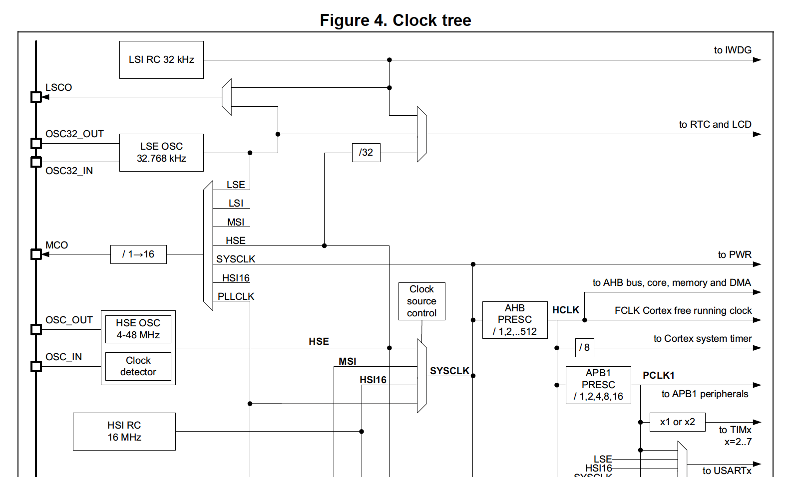
    
   <b>Rys.1.7</b> <i>Fragment dokumentacji mikrokontrolera przrezentujący połączenia pomiędzy   różnymi źródłami taktowania zegara RTC [1]</i>

Domyślnie wbudowany w STM32 zegar RTC działa w trybie LSI, w którym to sam mikrokontroler generuje wewnętrzne impulsy zegarowe bez potrzeby korzystania ze źródeł zewnętrznych. Rozwiązanie to jest szczególnie użyteczne w przypadku krótkotrwałego odmierzania czasu, ponieważ jest szybkie oraz nie zużywa dodatkowych pinów. Głównym ograniczeniem trybu LSI jest jego bardzo niska dokładność, wynosząca około 5% (*rysunek 1.8*). Oznacza to, że po upływie 10 minut zegar może osiągnąć odchylenie wynoszące aż 30 sekund, co w przypadku zastosowanego algorytmu TOTP jest nieakceptowalne.

   
    
   <b>Rys.1.8</b> <i>Fragment dokumentacji mikrokontrolera STM32 opisujący   dokładność zegara RTC w trybie LSI [1]</i>

W celu rozwiązania powyższego problemu zastosowano dodatkowe, zewnętrzne źródło taktowania w postaci wbudowanego w płytkę NUCLEO rezonatora kwarcowego LSE o częstotliwości ok. 32 kHz. Wykorzystanie trybu LSE w połączeniu z wbudowanym mechanizmem zegarowym umożliwiło uruchomienie funkcji autokalibracji zegara MSI, zwiększając przy tym dokładność i redukując błąd do poziomu 0,25% (*rysunek 1.9*). Ostatecznie oznacza to, że przewidziane odchylenie 30 sekund osiągnięte zostanie dopiero po upływie ok. 3,5 godziny, co w przypadku opisywanego prototypu jest wynikiem w pełni zadowalającym.

   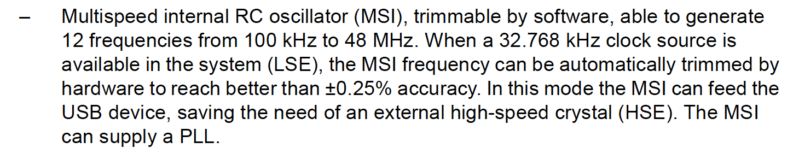
    
   <b>Rys.1.9</b> <i>Fragment dokumentacji mikrokontrolera STM32 opisujący   dokładność zegara RTC w trybie MSI (LSE) [1]</i>

#### 1.3.2. WatchDog

Aby zwiększyć niezawodność całego układu, zastosowany został moduł licznika Watchdog, którego zadaniem jest monitorowanie ciągłość pracy narzędzia oraz ochrona przed nieprzewidzianym zawieszeniem oprogramowania.
W projekcie wykorzystano modułu IWDG, który to charakteryzuje się pełną niezależnością względem głównego zegara mikrokontrolera. W poróbnaniu do podobnego modułu WWDG, zatrzymanie zegara RTC nie skutkuje unieruchomieniem Watchdoga.
Autonomiczność modułu IWDG ma kluczowe znaczenie z perspektywy energooszczędności projektu. Watchdog działa niezależnie od stanu głównego procesora, co pozwala na jego funkcjonowanie nawet w trybie oszczędzania energii — Standby (*rysunek 1.10*). Co więcej, IWDG może generować sygnały wybudzające mikrokontroler z uśpienia, co dodatkowo zwiększa wszechstronność oraz sprzyja potencjalnej rozbudowie.

   
    
   <b>Rys.1.10</b> <i>Fragment dokumentacji przedstawiający moduły działające podczas aktywnego   trybu Standby oraz generujące sygnały wybudzające [1]</i>

### 1.4. Pamięć nieulotna EEPROM

Pomimo faktu, że STM32L476RG dysponuje wbudowaną pamięcią nieulotną FLASH o rozmiarze 1 MB, w projekcie zastosowano niezależny moduł EEPROM.
Decyzja uwarunkowana została niniejszymi powodami:

1. **Bezpieczeństwo układu** — pamięć FLASH ma mniejszą liczbę cykli, aniżeli EEPROM. Producent mikrokontrolera deklaruje ok. 10 000 cykli.
2. **Przyszła rozbudowa** — układ zaprojektowany został z myślą o przyszłej rozbudowie. Zastosowanie niezależnego modułu umożliwia dowolną i szybką modyfikację układu.

#### 1.4.1. Parametry techniczne modułu pamięci

**Tab. 1.5** *Parametry techniczne modułu pamięci nieulotnej EEPROM [3]*
<table>
  <tr>
    <th>Parametr</th>
    <th>Wartość</th>
  </tr>
  <tr>
    <td>Typ pamięci</td>
    <td>EEPROM</td>
  </tr>
  <tr>
    <td>Moduł pamięci</td>
    <td>24AA01-I/P</td>
  </tr>
  <tr>
    <td>Organizacja pamięci</td>
    <td>128 x 8 - bit</td>
  </tr>
  <tr>
    <td>Liczba cylki nadpisań</td>
    <td>>1 000 000</td>
  </tr>
  <tr>
    <td>Interface</td>
    <td>I2C (TWI)</td>
  </tr>
  <tr>
    <td>Częstotliowść taktowania</td>
    <td>400 kHz</td>
  </tr>
  <tr>
    <td>Liczba pinów I/O</td>
    <td>8</td>
  </tr>
  <tr>
    <td>Zakres napięcia pracy</td>
    <td>1,71–5,5 V</td>
  </tr>
  <tr>
    <td>Obudowa</td>
    <td>8-pin PDIP</td>
  </tr>
</table>

#### 1.4.2. Sposób połączenie modułu z mikrokontrolerem

Moduł pamięci podłączony został zgodnie z poniższym schematem (*rysunek 1.11*):

1. P1 oraz P2 są liniami komunikacyjnymi interfejsu I2C, odpowiednio SDA i SCL. Podłączono je do pinów mikrokontrolera skonfigurowanych jako moduł I2C1 (PB6 i PB7). Aby uniknąć ryzyka zwarcia, wejścia mikrokontrolera zostały ustawione w tryb open-drain. W związku z tym konieczne było dodanie dwóch rezystorów podciągających (4,7 kΩ) podłączonych do linii zasilania (3,3 V).
2. P4 to pin zasilający modułu (VCC), który został podłączony bezpośrednio do linii zasilania (3,3 V).
3. P8 to pin uziemienia modułu (VSS) i został podłączony bezpośrednio do linii uziemiającej (GND).
4. P3 pełni funkcję wejścia Write Protect (WP), które zabezpiecza moduł przed niepożądanym zapisem danych. Aby umożliwić zapis, pin WP zwarty został z masą.
5. Aby zniwelować zakłócenia pomiędzy linią zasilania a masą, zastosowano kondensator o pojemności 100 nF (*tabela 1.6*).

**Tab. 1.6** *Połączenie układu pamięci 24AA01 z mikrokontrolerem STM32*
<table>
  <tr>
    <th>Piny 24AA01</th>
    <th>Piny STM32</th>
    <th>Opis</th>
  </tr>
  <tr>
    <td>P1 (SDA)</td>
    <td>PB7 (I2C1)</td>
    <td>+ Rezystor podciągający 4,7 kΩ</td>
  </tr>
  <tr>
    <td>P2 (SCL)</td>
    <td>PB6 (I2C1)</td>
    <td>+ Rezystor podciągający 4,7 kΩ</td>
  </tr>
  <tr>
    <td>P3 (WP)</td>
    <td>Masa (GND)</td>
    <td rowspan="2">Kondensator 100 nF pomiędzy liniami</td>
  </tr>
  <tr>
    <td>P4 (VCC)</td>
    <td>Zasilanie (3,3 V)</td>
  </tr>
  <tr>
    <td>P5 (A0)</td>
    <td>-</td>
    <td rowspan="3">STM32L476RG</td>
  </tr>
  <tr>
    <td>P6 (A1)</td>
    <td>-</td>
  </tr>
  <tr>
    <td>P7 (A2)</td>
    <td>-</td>
  </tr>
  <tr>
    <td>P8 (VSS)</td>
    <td>Masa (GND)</td>
    <td>-</td>
  </tr>
</table>

   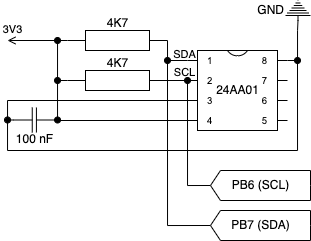
    
   <b>Rys.1.11</b> <i>Schemat elektroniczny połączenia modułu 24AA01 w   opracowanym układzie</i>

### 1.5. Komunikacja z układem (GPIO)

Do podstawowej komunikacji z układem wykorzystano:

#### 1.5.1. Przyciski

Aby umożliwić użytkownikowi sterowanie układem oraz wykonywanie wybranych operacji, konieczne było zastosowanie przycisków. Domyślnie płytka NUCLEO wyposażona jest w jeden przycisk (USER_BTN1), co w przypadku tego projektu jest liczbą niewystarczającą. W związku z tym do układu dobudowano dodatkowe dwa (USER_BTN_UP oraz USER_BTN_DOWN) (*tabela 1.7*).
Aby zapewnić jednakowe funkcjonowanie, nowe przyciski skonfigurowano w sposób analogiczny dla tego domyślnie wbudowanego. Wszystkie podłączone zostały w trybie pull-up z zastosowaniem rezystora 4,7 kΩ. W celu eliminacji zakłóceń wynikających z efektu „drgania styków” do każdego przycisku zastosowano filtru RC, składające się z rezystora 100 Ω oraz kondensatora 100 nF.

**Tab. 1.7** *Piny GPIO wykorzystane przez konkretne przyciski*
<table>
  <tr>
    <th>Nazwa przycisku</th>
    <th>Nazwa pinu</th>
    <th>Opis</th>
  </tr>
  <tr>
    <td>USER_BTN1</td>
    <td>PC13</td>
    <td>Wbudowany w NUCLEO</td>
  </tr>
  <tr>
    <td>USER_BTN_UP</td>
    <td>PC12</td>
    <td rowspan="2">Dobudowane</td>
  </tr>
  <tr>
    <td>USER_BTN_DOWN</td>
    <td>PC11</td>
  </tr>
</table>

Schemat połączeń pinów GPIO (*rysunek 1.12*):

   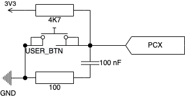
    
   <b>Rys.1.12</b> <i>Schemat elektroniczny pojedynczego przycisku</i>

#### 1.5.2. Dioda LED

Do wizualnej oceny pracy modułu Watchdog wykorzystano diodę LED (LD2) wbudowaną w płytkę rozwojową NUCLEO. Ta domyślnie podłączona jest z pinem GPIO PA5, a w jej obwodzie zastosowano rezystor ograniczający o wartości 100 Ω (*rysunek 1.13*).

   
    
   <b>Rys.1.13</b> <i>Schemat elektroniczny diody LD2</i>

### 1.6. Wykaz elementów oraz kosztorys

Poniższa tabela (*tabela 1.8*) przedstawia zestawienie wszystkich modułów oraz elementów użytych podczas projektowania układu elektronicznego opisywanego układu. Co więcej, w tabeli uwzględniono aktualne ceny rynkowe poszczególnych komponentów, w celu oszacowania całkowitego kosztu prototypu.

**Tab. 1.8** *Parametry techniczne zastosowanego w projekcie mikrokontrolera [1]*
<table>
  <tr>
    <th>Lp.</th>
    <th>Nazwa komponentu</th>
    <th>Ilość</th>
  </tr>
  <tr>
    <td>1</td>
    <td>STM32 NUCLEO-L476RG</td>
    <td>1</td>
  </tr>
  <tr>
    <td>2</td>
    <td>EEPROM 24AA01 -I/P</td>
    <td>1</td>
  </tr>
  <tr>
    <td>3</td>
    <td>Tact Switch 6x6mm</td>
    <td>2</td>
  </tr>
  <tr>
    <td>4</td>
    <td>Przełącznik suwakowy 2-pozycyjny</td>
    <td>1</td>
  </tr>
  <tr>
    <td>5</td>
    <td>Podstawka na baterię CR2032</td>
    <td>1</td>
  </tr>
  <tr>
    <td>6</td>
    <td>Bateria litowa CR2032</td>
    <td>1</td>
  </tr>
  <tr>
    <td>7</td>
    <td>Rezystor 4,7 kΩ</td>
    <td>3</td>
  </tr>
  <tr>
    <td>8</td>
    <td>Rezystor 100 Ω</td>
    <td>3</td>
  </tr>
  <tr>
    <td>9</td>
    <td>Kondensator ceramiczny 100 nF</td>
    <td>3</td>
  </tr>
</table>

W zestawieniu nieuwzględnione zostały:

- Przewód USB (używany przy programowaniu),
- Okablowanie (łączące poszczególne elementy),
- Płytka prototypowa (na której opracowano prototyp).

## 2. Realizacja części programowej

### 2.1. Wstęp

W niniejszym rozdziale omówiono szczegóły dotyczące implementacji oprogramowania sterującego zaprojektowanym układem elektronicznym. Przedstawiono oraz opisano użyte narzędzia, technologie, biblioteki oraz metody konfiguracji wbudowanych modułów mikrokontrolera STM32.
Oprogramowanie zostało zaprojektowane z naciskiem na niezawodność oraz możliwie jak największą prostotę obsługi. Główna funkcjonalność, czyli generowanie tokenów autoryzujących (OTP), uzupełniona została o dodatkowe operacje zwiększające zastosowanie samego urządzenia. Zaimplementowano również podstawowe mechanizmy konfiguracyjne, które w znacznym stopniu eliminują konieczność modyfikacji kodu źródłowego, tworząc w ten sposób system bardziej przyjazny użytkownikowi.

### 2.2. Język oraz wykaz użytych bibliotek zewnętrznych

Oprogramowanie zaimplementowane w prototypie w całości napisane zostało w języku C, zapewniając przy tym wysoką optymalizację kodu oraz kontrolę nad niskopoziomowym sterowaniem modułami. Sam język uzupełniono bibliotekami standardowymi (std).
W procesie tworzenia oprogramowania, oprócz bibliotek wbudowanych w język programowania, zastosowano również zewnętrzne biblioteki typu open-source, których licencje umożliwiają komercyjne oraz niekomercyjne wykorzystanie (licencja MIT). Biblioteki te umożliwiły niezawodną implementację algorytmów kryptograficznych oraz znacząco ułatwił proces zarządzanie peryferiami elektronicznymi, w tym mikrokontrolerem STM32 oraz pamięcią EEPROM.

**Wykorzystane w projekcie biblioteki zewnętrzne:**

1. **HAL** — opracowana przez STMicroelectronics biblioteka upraszczająca sterowanie mikrokotrolerami z rodziny STM32 poprzez zapewnienie wysokopoziomowego dostępu do sprzętu oraz peryferiów procesora.
2. **TOTP** — gotowe opracowanie algorytmu zgodne ze standardem RFC 6238, pozwalające na generowanie jednorazowych tokenów uwierzytelniających.
3. **BASE32** — biblioteka zawierająca skrypt rozkodowujący tekst w formacie BASE32 do postaci jawnej.
4. **SHA1** — implementująca funkcji skrótu SHA-1, używana przez alg. TOTP.
5. **Sterownik** eeprom — prosta biblioteka zawierająca dwie funkcje umożliwiające odczytanie oraz zapisanie pojedynczych bajtów na podstawie wskazanego w argumencie adresu komórki pamięci w module EEPROM 24AA01.

### 2.3. Konfiguracja modułów mikrokontrolera STM32

Głównym narzędziem użytym podczas tworzenia oprogramowania było środowisko STM32CubeIDE. Opracowane przez STMicroelectronics, IDE oferuje podstawowe funkcje typowe dla nowoczesnych edytorów kodu; auto uzupełnianie kodu, podpowiedzi składni, czy debugowanie. Zdecydowaną przewagą względem konkurencji jest fakt, że oprogramowanie posiada zaawansowany system konfiguracji mikrokontrolera, przedstawiony w postaci graficznego interface użytkownika (GUI).
Konfiguracje modułów użytych w prototypie:

#### 2.3.1. Debuger (Serial Wire)

Aktywacja interface Serial Wire Debug (SWD) jako głównego trybu debugowania użytego w systemie mikrokontrolera STM32.

**Przypisane piny:** PA13, PA14.
**Konfiguracja w STM32CubeIDE:**

- Kategoria: **_System Core_**,
  - Sekcja: **_SYS_**,
    - Debug: **_Serial Wire_**.

#### 2.3.2. USART

Ustawienie interface szeregowego USART2 w tryb komunikacji asynchronicznej, czyli bez synchronizacji zegara pamiędzy urządzeniami wymieniającymi dane.
**Przypisane piny:** PA2, PA3.
**Konfiguracja w STM32CubeIDE:**

- Kategoria: **_Connectivity_**,
  - Sekcja: **_USART2_**,
    - Mode: **_Ansynchronous_**.

#### 2.3.3. GPIO

Definicje cyfrowych wejść i wyjść umożliwiły konfigurację elementów pozwalających na bezpośrednią komunikację narzędzia z użytkownikiem (diody LED oraz przycisków) (*tabela 2.1*).

**Przypisane piny:** PA2, PA3.
**Konfiguracja w STM32CubeIDE:**
Kategoria: **_System Core_**,
Sekcja: **_GPIO_**.

**Tab. 2.1** *Podstawowe parametry cyfrowych pinów wejścia i wyjścia GPIO*
<table>
  <tr>
    <th>Element</th>
    <th>Przypisana nazwa</th>
    <th>Tryb pracy</th>
    <th>Stan wychodzący</th>
  </tr>
  <tr>
    <td>Dioda LED</td>
    <td>LD2</td>
    <td>GPIO_OUTPUT</td>
    <td>Niski (Low)</td>
  </tr>
  <tr>
    <td rowspan="3">Przyciski</td>
    <td>USER_BTN_1</td>
    <td>GPIO_EXTI13</td>
    <td rowspan="3">Przerwanie generowane co 1 ms</td>
  </tr>
  <tr>
    <td>USER_BTN_UP</td>
    <td>GPIO_EXTI12</td>
  </tr>
  <tr>
    <td>USER_BTN_DOWN</td>
    <td>GPIO_EXTI11</td>
  </tr>
</table>

#### 2.3.4. RTC

Konfiguracja wbudowanego modułu zegara RTC (LSI) wraz z zewnętrznym generatorem impulsów zegarowych (LSE) w postaci rezonatora kwarcowego oraz połączonym z nim modułem auto konfiguracji MSI.

**Przypisane piny:** PC14, PC15.
**Konfiguracja w STM32CubeIDE:**
_W pierwszej kolejności należy uruchomić modułu zegara RTC:_

- Kategoria: **_System Core_**,
  - Sekcja: **_RCC_**,
    - Low Speed Clock (LSE): **_Crystal/Ceramic Resonator_**.
    - Konfiguracja: **_RCC Parameters_**,
      - MSI Auto Calibration: **_Enable_** (aktywacja powinna nastąpić automatycznie).

_Kolejnym etapem jest aktywacja zewnętrznego źródła impulsów (LSE):_

- Kategoria: **_Timers_**,
  - Sekcja: **_RTC_**,
    - Aktywowanie opcji: **_Activate Clock Source_**.

#### 2.3.5. I2C

W celu umożliwienia komunikacji z zewnętrznym modułem pamięci EEPROM aktywowany został wbudowany w mikrokontroler interface I2C1, umożliwiający wymianę danych pomiędzy urządzeniami.

**Przypisane piny:** PB6, PB7.
**Konfiguracja w STM32CubeIDE:**

- Kategoria: **_Connectivity_**,
  - Sekcja: **_I2C1_**,
    - I2C: **_I2C_**,
    - (Pozostałe parametry pozostały w ustawieniach domyślnych).

#### 2.3.6. IWDG

Aby uchronić system przed nieprzewidzianym zawieszeniem oprogramowania aktywowany, został moduł WatchDog w trybie IWDG.

**Konfiguracja w STM32CubeIDE:**

- Kategoria: **_System Core_**,
  - Sekcja: **_IWDG_**,
    - Aktywowanie opcji: **_Activated_**.

#### 2.3.7. NVIC

Aby zoptymalizować czas pracy urządzenia, przyciski podłączone do cyfrowych wejść GPIO zostały skonfigurowane w trybie GPIO_EXTI, co pozwala na generowanie przerwań systemowych w momencie ich naciśnięcia. Aby w pełni wykorzystać mechanizm przerwań, bez ryzyka zawieszenia układu niezbędna była modyfikacja domyślnie ustawionych wartości priorytetów w tabeli kontrolera przerwań (NVIC).

**Konfiguracja w STM32CubeIDE:**
_Konfiguracja systemu przerwań na wejściach GPIO_,

- Kategoria: **_System Core_**,
  - Sekcja: **_GPIO_**, \* Zakładka: **_NVIC_**, \* Aktywowanie opcji: **_EXTI line [15:10] interrupts_**.
    _Zmiana priorytetów przerwań:_
- Kategoria: **_System Core_**,
  - Sekcja: **_IWDG_**,
    - Zmiany wartości przedstawione zostały w poniższej tabeli (*tabela 2.2*).

**Tab. 2.2** *Zmiana wartości priorytetów dla poszczególnych przerwań*
<table>
  <tr>
    <th>Nazwa przerwania</th>
    <th>Domyślny priorytet</th>
    <th>Nowy priorytet</th>
    <th>Opis</th>
  </tr>
  <tr>
    <td>Time base: System tick timer</td>
    <td>9</td>
    <td>0</td>
    <td>Przerwanie generowane co 1 ms</td>
  </tr>
  <tr>
    <td>EXTI line [15:10] interrupts</td>
    <td>0</td>
    <td>10</td>
    <td>Przerwanie generowane przez impuls odebrany na wejściu GPIO na pinach od 10 do 15</td>
  </tr>
</table>

### 2.4. Implementacja modułu pamięci

Na potrzeby realizacji niniejszego projektu opracowano niezależny system przechowywania oraz zarządzania danymi w pamięci. W prototypie informacje składowane są w postaci danych ogólnych (dotyczących całego urządzenia) oraz pojedynczych kluczy wraz z przypisanymi do nich informacjami. Całość zaprojektowana została z myślą o optymalizacji z powodu ograniczonej przestrzeni zapisowej. System nie posiada zabezpieczeń chroniących pamięć przed przypadkowym (lub celowym) przepełnieniem lub wyciekiem danych. Opcja ta może stanowić potencjalną ścieżkę przyszłego rozwoju oprogramowania.

#### 2.4.1. Sposób przechowywania danych w pamięci

Dane przechowywane w pamięci podzielono na 2 niezależne grupy):

1. **Dane ogólne** (ang. general data) — obejmują podstawowe informacje niezbędne przy każdorazowej próbie inicjalizacji systemu (*rysunek 2.1*).   Do danych ogólnych zaliczono:
   1. **Bajt inicjalizujący** — statycznie zapisana w kodzie wartość, informująca system, że pamięć prawdopodobnie była już wykorzystywana.
   2. **Ostatni adres pamięci** — adres ostatniej dostępnej komórki w pamięci.
   3. **Maksymalna liczba kluczy** — liczba kluczy, która zmieści się w pamięci.
   4. **Aktualna liczba kluczy** — liczba aktualnie zapisanych kluczy w pamięci.
   5. **Ostatni użyty klucz** — wskazuje adres ramki ostatniego, aktywnego klucza.
   6. **Flagi systemowe** — bity opisujące konfigurację oraz stan systemu.

   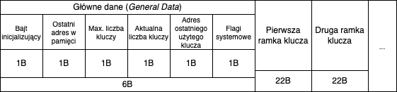
    
   <b>Rys.2.1</b> <i>Schemat poglądowy przedstawiający format zapisu danych w pamięci</i>

1. **Klucze wraz z informacjami** — każdy klucz, wraz z przypisanymi do niego danymi przechowywany jest w postaci indywidualnej 22-bajtowej ramki (*rysunek 2.2*). W jej strukturze zawarte zostały następujące informacje:
   1. **Indeks klucza** — indywidualny numer klucza w pamięci.
   2. **Rozmiar klucza i nazwy** — informacja o liczbie znaków zapisanego w ramce klucza oraz jego nazwy. 4 najbardziej znaczące bity odnoszą się do klucza, natomiast 4 najmniej znaczące do nazwy.
   3. **Klucz** — rozkodowany klucz prywatny, zapisany w postaci jawnej.
   4. **Nazwa** — nazwa nadana kluczowi przez użytkownika (max. 5 znaków).
   5. **Flagi klucza** — pojedyncze bity opisujące charakterystykę klucza. (Z całego dostępnego bajtu użyty został wyłącznie najbardziej znaczące bity).
   6. **Flaga nadpisania** (ang. Overwrite, OW) — informuje, że ramka jest nieaktywna i może zostać nadpisana nowym kluczem.
   7. **CRC** — bajt przeznaczony na wyliczenie sumy kontrolnej z całej ramki. Mechanizm ten ostatecznie nie znalazł się w opisywanej implementacji systemu.

   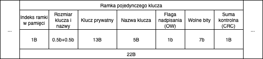
    
   <b>Rys.2.2</b> <i>Schemat poglądowy pojedynczej ramki (klucza) zapisywanej w pamięci</i>

#### 2.4.2. Operacje na pamięci

Większość zaimplementowanych w kodzie mechanizmów operacji na pamięci zrealizowana została za pomocą określonych „przeskoków” pomiędzy poszczególnymi bajtami, które zostały umieszczone w ściśle określonych pozycjach wewnątrz ramek. Same ramki przechowywane są w pamięci jedna za drugą, co również umożliwia wykonywanie precyzyjnych przejść między kolejnymi kluczami.

**Przykładowe funkcje kontrolujące moduł pamięci:**

- Sprawdzenie oraz inicjalizacja pamięci (*rysunek 2.4*),
- Zapisanie lub odczytanie danych ogólnych,
- Zapisanie lub odczytanie danych z ramki klucza,
- Generowanie nowej ramki na podstawie dostarczonych informacji,
- Funkcja sprawdzająca stan flagi nadpisania (OW),
- Funkcja resetująca ramkę i aktywująca flagę nadpisania (OW).

### 2.5. Implementacja oraz synchronizacja modułu RTC

Moduł zegara RTC stanowi kluczowy element umożliwiający generowanie tokenów OTP. Do poprawnego działania algorytm TOTP wymaga dostępu do aktualnego czasu uniwersalnego (UTC). W celu zwiększenia komfortu użytkownika podczas procesu synchronizacji, system wyposażono w prosty mechanizm konfiguracji czasu UTC względem wprowadzonych danych lokalnych.

**Operacje na zegarze RTC:**

1. **Synchronizacja czasu zegara** — użytkownik proszony jest o wpisanie za pośrednictwem klawiatury aktualnej daty oraz godziny obowiązującej w jego lokalnej strefie czasowej. Dane powinny zostać przekazane zgodnie z zaprezentowanym formatem: `[dd-mm-yyyy,hh:mm:ss]`
   Pozyskany ciąg znaków dzielony jest na fragmenty odpowiadające aktualnej dacie oraz godzinie. Sama godzina dodatkowo modyfikowana jest na podstawie informacji o strefie czasowej użytkownika, które umożliwiają poprawne przeliczenie czasu lokalnego na czas UTC. Przetworzone dane przesyłane są do wbudowanego w mikrokontroler modułu RTC, który następnie aktualizuje je wraz z upływem czasu.
2. **Pobranie aktualnego czasu oraz daty** — operacja ta wymaga jedynie wywołania odpowiednich funkcji z biblioteki HAL, które odczytują dane zapisane w module RTC i przypisuje je do wyznaczonych zmiennych.
3. **Inicjalizacja modułu RTC** — głównym zadaniem funkcji jest sprawdzenie, czy dane zapisane w module RTC są czasem skonfigurowanym przez użytkownika. Jeżeli pozyskane wartości świadczą o zresetowaniu modułu, automatycznie wywoływana jest funkcji synchronizująca (*rysunek 2.3*).

   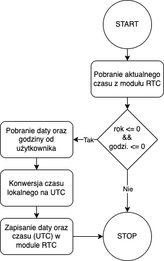
    
   <b>Rys.2.3</b> <i>Schemat blokowy inicjalizacji zegara RTC</i>

4. **Obliczanie znacznika czasu (TimeStamp)** — na podstawie przesłanych danych o aktualnej dacie oraz godzinie, funkcja wylicza oraz zwraca czas przedstawiony w formacie UNIX Epoch TimeStamp.

### 2.6. Proces inicjalizacji urządzenia

Przed właściwymy rozpoczęciem działania systemu wymagane jest przeprowadzenie procesu inicjalizacji. W jego ramach urządzenie weryfikuje poprawność działania kluczowych modułów, sprawdza dostępność wymaganych danych oraz wczytuje informacje ogólne do pamięci operacyjnej systemu.
Proces inicjalizacji składa się z siedmiu kroków, które muszą zostać pomyślnie zakończone, aby system mógł rozpocząć generowanie tokenów (*rysunek 2.5*).

**Poszczególne etapy obejmują:**

1. **Inicjalizację pamięci EEPROM** — weryfikacja kompatybilności pamięci z systemem. W przypadku pierwszego uruchomienia urządzenia, pamięć jest czyszczona i poddawana procesowi inicjalizacji (*rysunek 2.4*).
2. **Inicjalizację zegara RTC** — sprawdzenie aktualnego czasu zapisanego w module RTC. Jeśli zegar nie został wcześniej skonfigurowany, automatycznie uruchamiany jest proces synchronizacji (*rysunek 2.3*).

   
    
   <b>Rys.2.4</b> <i>Schemat blokowy inicjalizacji pamięci EEPROM</i>

1. **Pobranie danych ogólnych z pamięci** — odczyt podstawowych informacji (ang. general data) z modułu pamięci nieulotnej. Dane są wczytywane do pamięci operacyjnej i wyświetlane użytkownikowi.
2. **Ustawienie ostatniego użytego klucza jako aktywnego** — adresu ramki ostatnio używanego klucza zostaje ponownie ustawiony jako aktywny.
3. **Załadowanie klucza z pamięci** — wczytanie klucza prywatnego na podstawie adresu ramki aktywnego klucza.
4. **Przejście w odpowiedni tryb pracy** — zgodnie z konfiguracją użytkownika urządzenie przechodzi w jeden z dwóch trybów pracy: pasywny lub aktywny.
5. **Rozpoczęcie pracy** — system jest w pełni zainicjalizowany i przygotowany do działania. Rozpoczyna się proces generowania tokenów OTP.

   
    
   <b>Rys.2.5</b> <i>Schemat blokowy przedstawiający etapy procesu   inicjalizacji systemu</i>

### 2.7. Generowania tokenów OTP

Niezależnie od trybu, w jakim pracuje urządzenie proces generowania tokenów OTP przebiega w sposób jednakowy. Kluczowym jego elementem jest przygotowanie odpowiednich danych wejściowych, które są następnie przetwarzane przez zaimplementowany w systemie algorytm kryptograficzny TOTP (*rysunek 2.6*).

**Proces generowania tokenu:**

1. **Wczytanie klucza prywatnego** — z pamięci urządzenia wczytywany jest aktywny klucz prywatny, który następnie przesyłany jest do funkcji w postaci jawnego tekstu. Zgodnie z wymogami algorytmu, nie akceptuje on danych zakodowanych w formacie BASE32.
2. **Pobranie i konwersja czasu** — z modułu RTC odczytywany zostaje aktualny czas, który następnie przeliczany jest na format UNIX Epoch TimeStamp.
3. **Uzupełnienie pozostałych parametrów** — do algorytmu przekazywane są dwie pozostałe wartości zapisane na stałe w kodzie:
   1. interwał czasowy (`= 30s`),
   2. liczba znaków w tokenie (`= 6`).
4. **Generowanie tokenu** — wszystkie dane wejściowe, tj. klucz prywatny, czas w formacie UNIX Epoch TimeStamp oraz parametry dodatkowe, są przekazywane do głównej funkcji algorytmu TOTP.

W rezultacie generowany jest aktualny token OTP, który następnie przekazany zostaje użytkownikowi za pośrednictwem portu seryjnego.

   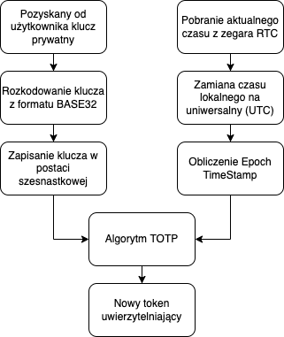
    
   <b>Rys.2.6</b> <i>Schemat blokowy przedstawiający proces   generowania tokenów OTP</i>

### 2.8. Dodatkowe opcje oraz ustawienia

Urządzenie daje użytkownikowi możliwość przeprowadzenia dodatkowych operacji (*rysunek 2.7*) związanych z zarządzaniem bazą kluczy, zmianą trybu pracy oraz konfiguracją samego systemu.

   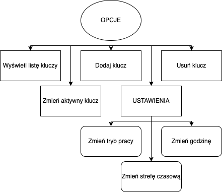
    
   <b>Rys.2.7</b> <i>Schemat blokowy dostępnych opcji oraz ustawień   systemowych</i>

#### 2.8.1. Wyświetlenie listy kluczy

**Przeznaczenie:**
Funkcja wyświetla użytkownikowi aktualną listy nazw wszystkich kluczy przechowywanych w pamięci urządzenia.

**Działanie:**
Algorytm przeszukuje zapisane w pamięci ramki oraz odczytując zapisane w nich nazwy. Liczba odczytanych kluczy powinna odpowiadać aktualnej liczbie kluczy zdefiniowanej w danych głównych (ang. general data) urządzenia. Pozyskane nazwy zapisywane są w pamięci operacyjnej, a następnie prezentowane użytkownikowi za pośrednictwem interfejsu w postaci listy (*rysunek 2.8*).

**Schemat logiki algorytmu:**

   
    
   <b>Rys.2.8</b> <i>Schemat blokowy algorytmu:   wyświetlania kluczy</i>

#### 2.8.2. Zmiana aktywnego klucza

**Przeznaczenie:**
Funkcja umożliwiająca zmianę aktywnego klucza, na podstawie którego generowane są nowe tokeny uwierzytelniające.

**Działanie:**
Algorytm przeszukuje kolejne ramki kluczy, w celu odnalezienia nazwy odpowiadającej tej podanej przez użytkownika. W przypadku znalezienia zgodności oraz potwierdzenia, że flaga nadpisania (OW) jest nieaktywna, adres ramki danego klucza zostaje zapisany w pamięci operacyjnej systemu jako klucz aktywny. Od tego momentu algorytm wykorzystuje go podczas procesu generowania tokenów OTP (*rysunek 2.9*).

**Schemat logiki algorytmu:**

   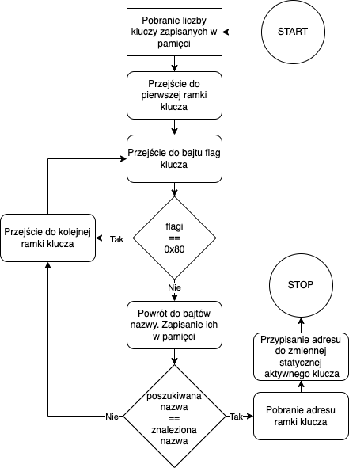
    
   <b>Rys.2.9</b> <i>Schemat blokowy algorytmu:   zmiany klucza</i>

#### 2.8.3. Dodanie klucza

**Przeznaczenie:**
Funkcja umożliwia dodanie do systemu nowego klucza autoryzującego. Zapisane w pamięci klucze mogą być naprzemiennie wykorzystywany do generowania tokenów OTP.

**Działanie:**
System weryfikuje możliwość dodania nowego klucza, sprawdzając, czy nieosiągnięty został założonego limitu. Jeśli dodanie jest możliwe, użytkownik proszony jest o przekazanie dwóch informacji: klucz prywatny oraz jego nazwy (maksymalnie 5 znaków). Klucz prywatny zostaje rozkodowany z formatu BASE32 do postaci jawnej, co pozwala zoptymalizować pamięć, ponieważ sam algorytm TOTP nie operuje na wartościach w formie zakodowanej. Następnie, na podstawie odebranych danych tworzona jest nowa ramka. System lokalizuje pierwsze dostępne miejsce w pamięci lub nadpisuje istniejącą ramkę, w której flaga nadpisania (OW) jest aktywna. Na koniec aktualizowana jest ogólna liczba kluczy w systemie (*rysunek 2.10*).

**Schemat logiki algorytmu:**:

   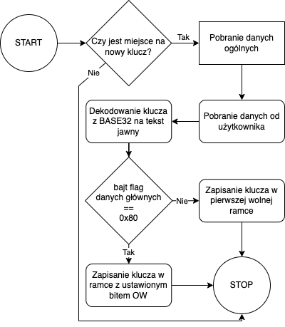
    
   <b>Rys.2.10</b> <i>Schemat blokowy algorytmu:   dodania klucza</i>

#### 2.8.4. Usunięcie klucza

**Przeznaczenie:**
Funkcja umożliwia usunięcie dowolnego zapisanego w pamięci klucza prywatnego wraz z przypisanymi danymi.

**Działanie:**
Algorytm wyszukuje klucz na podstawie podanej przez użytkownika nazwy. Po zlokalizowaniu ramka klucza zostaje wyzerowana, a flaga nadpisania (OW) ustawiona na wartość 1, co przygotowuje ją do ponownego zapisu. Na koniec aktualizowana jest ogólna liczba kluczy w systemie (*rysunek 2.11*).

**Schemat logiki algorytmu:**

   
    
   <b>Rys.2.11</b> <i>Schemat blokowy algorytmu:   usuwania klucza</i>

#### 2.8.5. Zmiana trybu pracy

Stworzone urządzenie oferuje dwa tryby pracy, różniące się sposobem generowania tokenów uwierzytelniających. Użytkownik może je zmieniać w dowolnym momencie, dostosowując system do swoich potrzeb.

**Dostępne tryby pracy:**
1. **Pasywny** (*passive*) — token uwierzytelniający generowany jest automatycznie, niezależnie od działań użytkownika. Proces generowania odbywa się w sposób ciągły, w określonych przedziałach czasowych.
2. **Aktywny** (*active*) — token uwierzytelniający generowany jest wyłącznie na żądanie użytkownika, poprzez wciśnięcie przycisku USER_BTN1. Naciśnięcie wywołuje przerwanie systemowe (ang. interrupt), w ramach którego wykonywany jest proces generowania nowego tokenu. Po utworzeniu tokenu przerwanie jest kończone, a wygenerowany token zostaje przesłany do użytkownika za pośrednictwem interface komunikacyjnego. Urządzenie natomiast przechodzi w stan oczekiwania.

#### 2.8.6. Zmiana godziny

Proces zmiany godziny przebiega analogicznie do inicjalizacji niezsynchronizowanego zegara RTC. Od użytkownika pobierane są dane dotyczące aktualnej daty oraz lokalnej godziny. Dane te są następnie dzielone, konwertowane do czasu UTC, a finalnie przekazywane do wbudowanego modułu zegara RTC.

#### 2.8.7. Zmiana strefy czasowej

***UWAGA:** Opisywana konfiguracja nie została zaimplementowana w finalnej wersji prototypu. Wszystkie dane dotyczące konwersji czasu lokalnego na UTC zapisane są statycznie w kodzie. Wprowadzenie zmian wymaga bezpośredniej ingerencji w kod systemu.*

## 3. Źródła

- [1] (2015) ‘Datasheet - STM32L476xx - Ultra-low-power Arm® Cortex®-M4 32-bit MCU+FPU’, STMicroelectronics . Available at: https://www.st.com/en/microcontrollers-microprocessors/stm32l476rg.html#documentation (Accessed: 2024).
- [2] (2014) ‘STM32 Nucleo-64 boards’, STMicroelectronics. Available at: https://www.st.com/resource/en/user_manual/um1724-stm32-nucleo64-boards-mb1136-stmicroelectronics.pdf (Accessed: 2020).
- [3] (2014) ‘STM32 Nucleo-64 boards’, STMicroelectronics. Available at: https://www.st.com/resource/en/user_manual/um1724-stm32-nucleo64-boards-mb1136-stmicroelectronics.pdf (Accessed: 2020).

## 4. Komentarz od autora

* Przedstawiona dokumentacja jest jedynie fragmentem pracy inżynierskiej autorstwa Jakub Sitarczyka oddanej do oceny dnia 11.12.2024,
* Nominalne praca stworzona była w języku polski. Treść przetłumaczona została bezpśrednio na język angielski, nie uwzględniając rysunków oraz schematów.
* Całość pracy objęta jest licencją MIT.